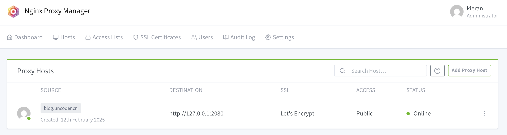
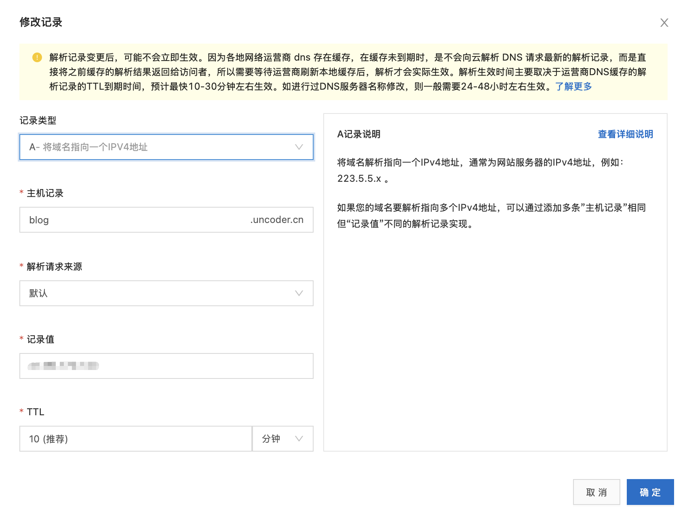

## Prerequisites

- A domain name
- A cloud server
- A [Hugo](https://hugo.opendocs.io) site

## Technology Stack

Website content generation: Chose the Hugo framework written in Go language. Hugo can quickly build static websites and supports various themes and plugins, meeting most requirements.

Automated build process: Using `Github Actions` to implement automated building. GitHub Actions can automate code building, testing, and deployment, supporting multiple languages and frameworks.

Public deployment solution: Using Alibaba Cloud server, resolving the domain name to point to the server, then using Nginx reverse proxy to forward requests to the Hugo site.

## Setup Steps

### 1. Website Files and Local Web Service

Use the `hugo` command to generate website files, typically using `hugo [options]`, and the generated files are usually in the `public` directory.

Use `nginx(docker)` to deploy a web service on local port 2080 (on the cloud server), with the website files being the `public` directory generated in the previous step.

Below are the Nginx docker compose file and configuration file. Make sure that the directory mapped to public and the root in the nginx.conf configuration file correspond.

```yaml
-- Nginx docker compose file
services:
  nginx:
    image: nginx:1.25-alpine
    container_name: my-nginx
    ports:
      - "2080:80"
      - "2443:443"
    volumes:
      - ./public:/usr/share/nginx/html
      - ./nginx-conf:/etc/nginx/conf.d
      - ./logs:/var/log/nginx
    restart: unless-stopped
    networks:
      - frontend

networks:
  frontend:
    driver: bridge
```

```nginx
# nginx.conf
server {
    listen 80;
    server_name blog.uncoder.cn;

    location / {
        root /usr/share/nginx/html;
        index index.html;
        try_files $uri $uri/ =404;
    }

    # Support for large files in photo galleries
    client_max_body_size 20M;
}
```

### 2. Reverse Proxy and Domain Registration

Currently, this web service running on local port 2080 can only be accessed using the `ip:port` method. If you want to access it using https + domain name, you need to configure a reverse proxy.

We need another `nginx` as a reverse proxy. Here I chose `nginx proxy manager(docker)` - a graphical management interface that can manage reverse proxies for multiple web services and automatically apply for SSL certificates, making it convenient to access using the `https` protocol. [NPM Project Page](https://github.com/NginxProxyManager/nginx-proxy-manager)



As shown, NPM will listen on port 443 of the server. When accessing the server with the domain name blog.uncoder.cn and https protocol, it will be forwarded to the local port 2080 (localhost:2080).

Finally, we need to modify the DNS resolution to make the domain point to this server. I'm using Alibaba Cloud server, and the DNS resolution service is also directly from Alibaba Cloud. Just add an A record.



Due to Chinese policy regulations, ports 80 and 443 on cloud servers generally require domain registration for use. We can register directly on Alibaba Cloud. After completing the domain registration, we can access it directly using the domain name. The registration steps are guided in detail on Alibaba Cloud, so I won't elaborate further. Finally, we can add the registration number in the website footer.


Don't forget to open the necessary ports in the firewall!


### 3. Automated Deployment

Finally, **optimizing the workflow**. Our website now needs to regenerate files after each change, and we need to continue operating on the deployment environment (cloud server). Therefore, we separate the deployment environment from the production environment by hosting the website project on Github and using the CI tool Github Actions to implement automated production and deployment.

The effect is that whenever there is a commit update to the master branch of the project, it will trigger a series of actions you have set. Let's look at what specific actions are executed in conjunction with the deploy file:

```yaml
name: Deploy Hugo Site

on:
  push:
    branches:
      - master  # Triggered when the master branch is updated

jobs:
  build-and-deploy:
    runs-on: ubuntu-latest

    steps:
    - name: Checkout code
      uses: actions/checkout@v3

    - name: Set up Hugo
      uses: peaceiris/actions-hugo@v2
      with:
        hugo-version: '0.143.1'  # Use the Hugo version you need
        extended: true

    - name: Clean cache
      run: rm -rf public/*

    - name: Build Hugo site
      run: hugo -D

    - name: Deploy to server
      uses: appleboy/scp-action@master
      with:
        host: ${{ secrets.SERVER_HOST }}
        username: ${{ secrets.SERVER_USER }}
        key: ${{ secrets.SSH_PRIVATE_KEY }}
        source: "public/"
        target: "/path/to/blog"  # Replace with your server website path
```

The entire process is as follows:
1. When we push code to the master branch
2. GitHub Actions creates a new Ubuntu environment
3. Install Hugo in this environment
4. Build our website
5. Transfer the built files to our server via SCP

This achieves automated deployment of the website, so we only need to focus on content creation. After committing the code, the deployment work will be completed automatically.