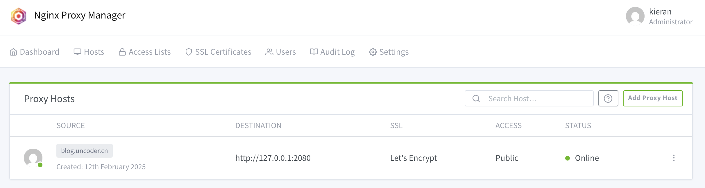
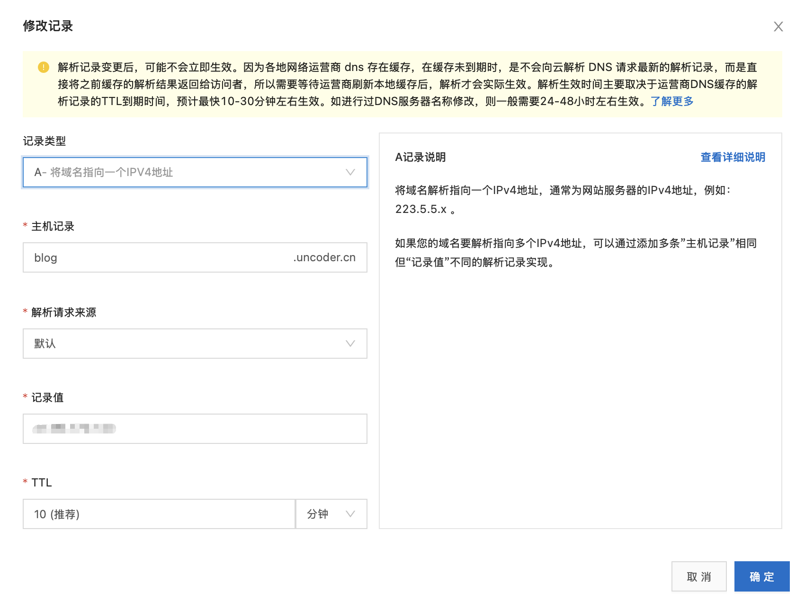

## 准备条件

- 一个域名
- 一个云服务器
- 一个 [Hugo](https://hugo.opendocs.io) 站点

## 技术选型

网站内容生成：选择了由 Go 语言编写的 Hugo 框架，hugo 可以快速构建出静态网站，并且支持多种主题和插件，可以满足大部分需求。

自动化构建流程：使用`Github Actions`来实现自动化构建，github actions可以实现代码的自动化构建、测试和部署，并且支持多种语言和框架。

公网部署方案：使用阿里云服务器，通过域名解析将域名指向服务器，然后通过nginx反向代理将请求转发到 hugo 站点。

## 搭建步骤

### 1. 网站文件和本地Web服务

使用`hugo`命令生成网站文件，通常是使用`hugo [options]`命令，生成的文件通常在`public`目录下。

使用`nginx(docker)`在本地（即云服务器上）的 2080 端口部署一个 Web 服务，网站文件即为上一步生成的`public`目录。

下面是 nginx 的 docker compose 文件和配置文件，注意 public 映射的目录和 nginx.conf 配置文件中的 root 要对应上。

```yaml
# nginx的docker compose文件
services:
  nginx:
    image: nginx:1.25-alpine
    container_name: my-nginx
    ports:
      - "2080:80"
      - "2443:443"
    volumes:
      - ./public:/usr/share/nginx/html
      - ./nginx-conf:/etc/nginx/conf.d
      - ./logs:/var/log/nginx
    restart: unless-stopped
    networks:
      - frontend

networks:
  frontend:
    driver: bridge
```

```nginx
# nginx.conf
server {
    listen 80;
    server_name blog.uncoder.cn;

    location / {
        root /usr/share/nginx/html;
        index index.html;
        try_files $uri $uri/ =404;
    }

    # 摄影集需要大文件支持
    client_max_body_size 20M;
}
```

### 2. 反向代理和备案

目前，这个运行在本地 2080 端口的 Web 服务只可以使用`ip:port`方式访问。如果想要用 https + 域名的方式访问，则需要配置反向代理。

我们需要另一个`nginx`做反向代理，这里我选用的是`nginx proxy manager(docker)`——一个图形化管理界面，可以管理多个web服务的反向代理并可以自动申请SSL证书，方便我们使用`https`协议访问。

NPM 的 Github 项目地址：


红茶大佬的视频教程:


如图，NPM 将会监听服务器的 443 端口，当以域名 blog.uncoder.cn 和 https 协议访问该服务器时，会被转发到本地的2080端口(localhost:2080)




最后我们需要修改 DNS 解析，让域名可以指向这个服务器。我是阿里云服务器，DNS解析服务也是直接用的阿里云的,添加一条A记录即可。



由于国内政策问题，一般云服务器的 80 和 443 端口都需要备案才可以使用。我们直接在阿里云进行备案，完成域名备案之后，就可以直接使用域名进行访问了。备案的步骤在阿里云都有很详细的引导，这里不再赘述。最后我们可以将备案号加在网站的脚注上。


别忘了在防火墙上放开必要的端口！


### 3. 自动化部署

最后，**优化流程**。我们的网站现在每次在改动之后，都需要重新生成文件，并且需要一直在部署环境（云服务器）上操作。所以我们将部署环境和生产环境分离，通过将网站项目托管在 Github 上，再使用 CI 工具 Github Actions 实现自动化生产和部署。

实现的效果是，每当项目的 master 分支有 commit 更新时，就会触发你设定的一系列动作。下面结合 deploy 文件看看具体执行了哪些动作：

```yaml
name: Deploy Hugo Site

on:
  push:
    branches:
      - master  # 当 master 分支有更新时触发

jobs:
  build-and-deploy:
    runs-on: ubuntu-latest

    steps:
    - name: Checkout code
      uses: actions/checkout@v3

    - name: Set up Hugo
      uses: peaceiris/actions-hugo@v2
      with:
        hugo-version: '0.143.1'  # 使用你需要的 Hugo 版本
        extended: true

    - name: Clean cache
      run: rm -rf public/*

    - name: Build Hugo site
      run: hugo -D

    - name: Deploy to server
      uses: appleboy/scp-action@master
      with:
        host: ${{ secrets.SERVER_HOST }}
        username: ${{ secrets.SERVER_USER }}
        key: ${{ secrets.SSH_PRIVATE_KEY }}
        source: "public/"
        target: "/path/to/blog"  # 替换为你的服务器网站路径
```

整个过程是这样的：
1. 当我们推送代码到 master 分支
2. GitHub Actions 会创建一个新的 Ubuntu 环境
3. 在这个环境中安装 Hugo
4. 构建我们的网站
5. 将构建好的文件通过 SCP 传输到我们的服务器

这样就实现了网站的自动化部署，我们只需要专注于内容的创作，提交代码后，部署工作会自动完成。 